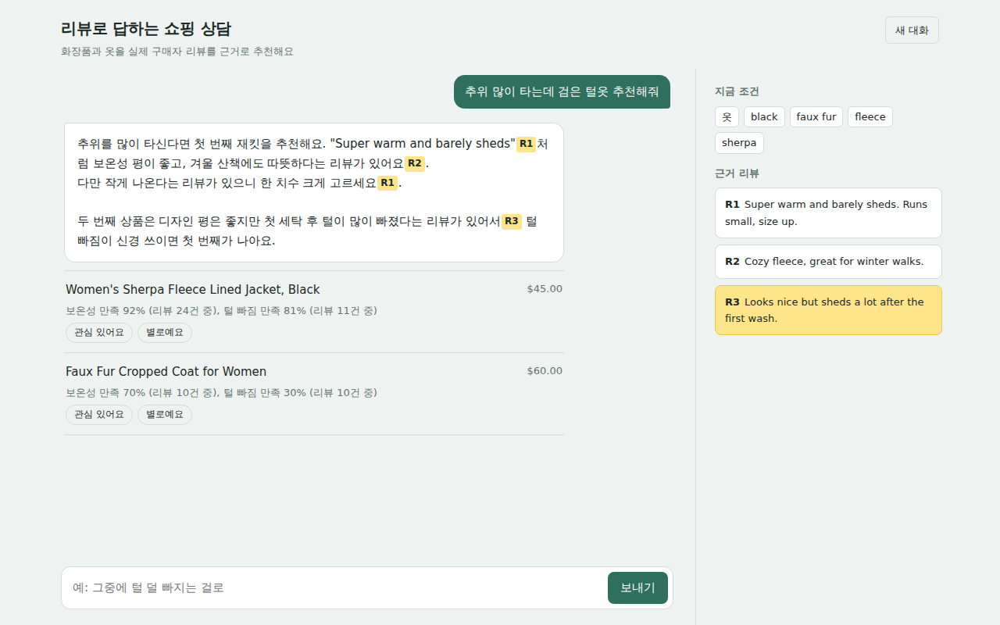
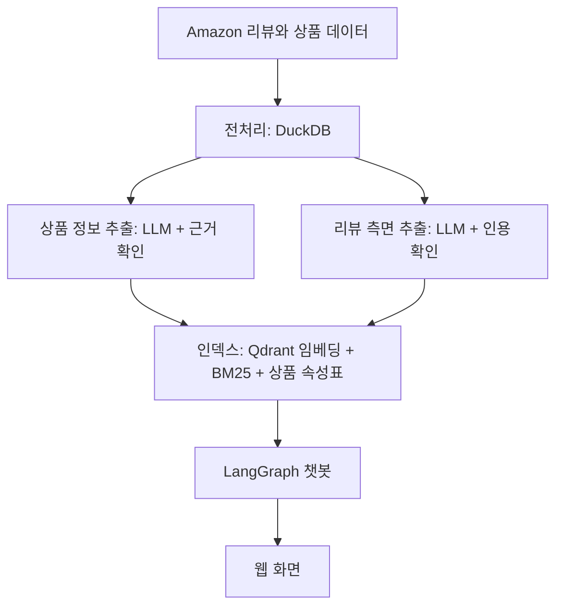
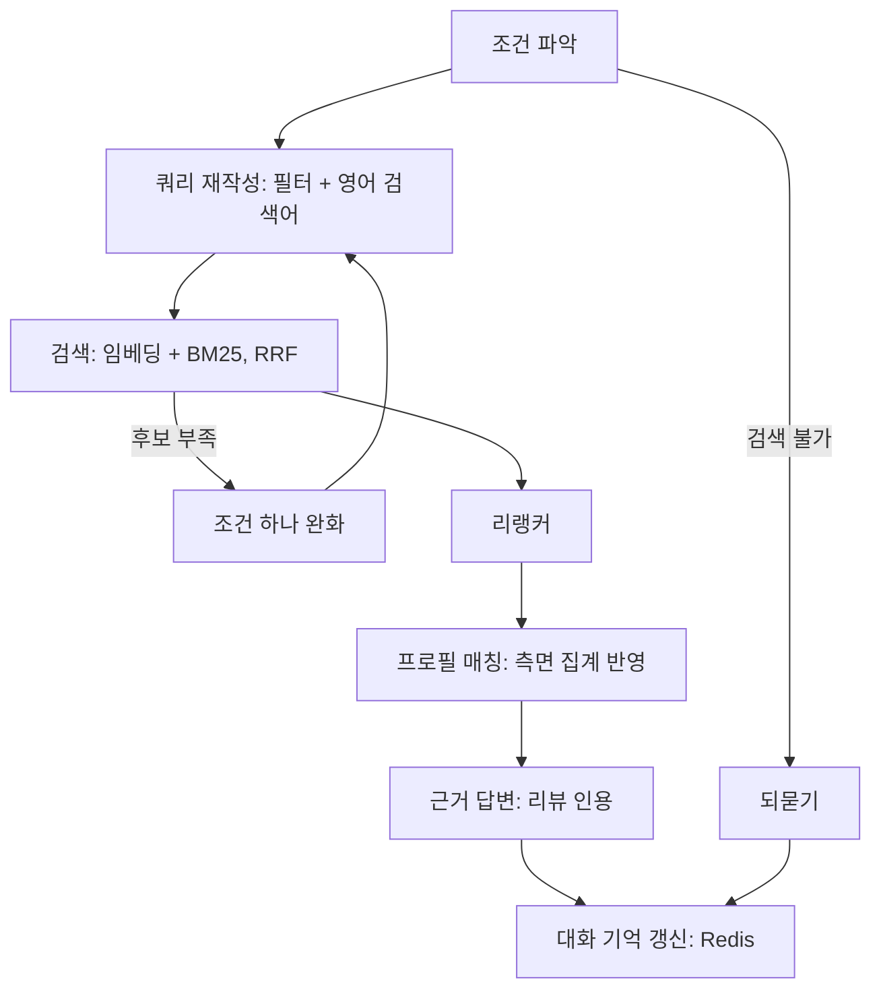

# product-extraction-chatbot

상품 정보와 리뷰를 LLM으로 정리 및 추출하고, 리뷰를 근거로 답하는 RAG 챗봇입니다.
모든 LLM은 로컬(RTX 3070 8GB)에서 Ollama로 돌립니다.

> 진행 중인 프로젝트입니다. 지금은 옷(Amazon Fashion) 도메인으로 처음부터 끝까지 한 번 돌아가는 상태이고, 화장품 도메인과 Kafka 스트리밍은 다음 단계입니다.

## 무엇을 하나

"추위 많이 타는데 검은 털옷 추천해줘"라고 물으면, 조건을 파악해서 리뷰를 검색하고, 실제 구매자 리뷰를 [R1]처럼 인용해서 추천 이유를 한국어로 답합니다. "그 중에 털 덜 빠지는 걸로"처럼 이어서 물으면 앞에서 보여준 상품 안에서 다시 고릅니다.

이를 위해 미리 두 가지를 LLM으로 추출해 둡니다.

- **상품 정보 추출**: 제목에 키워드가 뒤섞이고 설명이 비어 있는 상품 데이터에서 종류, 소재, 색상, 계절, 핏을 정해진 값으로 뽑아 검색 필터로 씁니다.
- **리뷰 측면 추출**: 리뷰에서 "보온성 좋음", "털 빠짐 적음", "사이즈 작게 나옴" 같은 측면을 뽑아 검색 단위와 상품별 집계로 씁니다.

## 구조



챗봇 그래프는 한 턴을 이렇게 처리합니다.



| 구성 | 사용한 것 |
|---|---|
| LLM | Qwen3 4B 8비트 (Ollama, 요청 4개 동시 처리) |
| 임베딩 | bge-small-en-v1.5 (CPU) |
| 리랭커 | bge-reranker-base (CPU) |
| 검색 | Qdrant + BM25, RRF로 결합 |
| 대화 흐름 | LangGraph |
| 대화 기억 | Redis |
| 서버, 화면 | FastAPI, HTML |
| 실행 환경 | Docker Compose (Ollama는 GPU, 나머지는 CPU) |

## 데이터

Amazon Reviews 2023의 Amazon_Fashion 카테고리를 씁니다. 이 카테고리는 상품 카테고리 정보가 100% 비어 있어서, 제목 단어(jacket, coat, fleece, sweater, hoodie 등)로 아우터와 니트류를 골랐습니다.

| 단계 | 개수 |
|---|---|
| 전체 상품 | 826,108 |
| 제목 단어 필터 통과 | 79,030 |
| 구매 인증 리뷰 10개 이상 중 첫 실행용 샘플 | 300 |
| 종류가 other(모자, 장갑 등)로 추출된 상품 제외 후 | 243 |
| 리뷰 (상품당 최대 20개, 중복 65개 제거) | 4,548 |

## 추출 품질을 높인 과정

로컬 작은 모델로 정해진 값을 뽑다 보니 문제가 계속 생겼고, 하나씩 원인을 찾아 고쳤습니다. 아래 정확도는 상품 10개를 원문과 대조해 직접 채점한 결과입니다. 정답 라벨로 하는 정식 평가는 다음 단계입니다.

**1. 모델이 선택지를 못 보고 있었다**

Ollama의 구조화 출력은 형식만 강제하고 고를 수 있는 값을 모델에게 보여주지 않습니다. 그래서 카디건을 pants, Olive를 navy로 아무 값이나 채웠습니다. 칸마다 고를 수 있는 값과 규칙(올리브는 green으로, 정보가 없으면 빈 값)을 프롬프트에 직접 적었습니다.

**2. 모델 크기와 정밀도 비교**

| 모델 | 종류 정확도 | 칸 단위 (50칸) | 상품당 시간 |
|---|---|---|---|
| Qwen3 1.7B 16비트 | 8/10 | 약 40 | 약 1초 |
| Qwen3 4B 8비트 | 10/10 | 약 45 | 약 2초 |

처음 쓴 1.7B 4비트도 카디건을 pants로 답했는데, 16비트로 올려도 같은 답을 해서 정밀도가 아니라 모델 크기의 한계로 판단했습니다. 8GB GPU에서 4B는 16비트(8GB)가 안 들어가서 8비트를 썼습니다.

**3. 목록 칸이 전부 비어 있었다**

칸에 기본값(빈 목록)을 주면 pydantic이 선택 항목으로 표시하고, Ollama는 그 칸을 건너뛰어도 되게 허용합니다. 4B는 소재와 색 칸을 통째로 건너뛰었고, 빈 목록이 기본값으로 채워져서 "없다고 답한 것"처럼 보였습니다. 모든 칸을 필수로 바꿔 해결했습니다. 같은 문제가 리뷰 추출과 대화 조건 파악 스키마에도 숨어 있어서 같이 고쳤습니다.

**4. 같은 값을 수백 번 반복했다**

목록 칸에 polyester를 252번 쓰다가 출력 길이 상한에서 잘리는 경우가 있었습니다. 목록 최대 개수를 스키마에 넣어 형식 단계에서 막았습니다.

**5. LLM이 고르고, 코드가 근거를 확인한다**

프롬프트를 고쳐도 원문에 없는 색(multi)이나 소재("Cottony-Soft"를 보고 cotton)를 넣는 경우가 남았습니다. 그래서 값마다 원문에 나와야 할 단어를 설정에 적어두고(gray는 gray, grey, charcoal, heather 등), 원문에 하나도 없으면 그 값을 버리게 했습니다. 리뷰 측면도 같은 방식으로, 모델이 낸 인용 구절이 실제 리뷰에 없으면 그 측면을 버립니다. 리뷰 측면 중 4~8%가 이 단계에서 걸러졌습니다.

이 다섯 단계를 거친 뒤 10개 상품의 남은 오류는 칸 1~2개 수준입니다.

## 대화 흐름에서 고친 것

작은 모델에게 맡기던 판단 중 규칙으로 정할 수 있는 것은 코드로 옮겼습니다.

- **조건 병합**: LLM은 "무엇을 추가, 교체, 삭제할지"만 말하고, 실제로 합치고 정해진 값인지 검증하는 건 코드가 합니다. 이 부분은 LLM 없이 테스트할 수 있습니다.
- **되묻기**: 모델이 처리할 수 있는 질문에도 영어로 되묻는 일이 있어서, 정말 검색이 불가능할 때만 코드가 되묻게 했습니다.
- **지시어**: "그중에, 이 중에"가 있으면 코드가 바로 "보여준 상품 안에서 고르기"로 처리합니다. "거기서"는 조건을 더해 새로 검색하는 뜻으로도 쓰여서 넣지 않았습니다.
- **옷 종류와 측면 단어**: "털옷, 아우터, 니트"는 종류 조건으로, "털 빠짐, 따뜻한, 사이즈"는 측면으로 설정 파일의 단어 목록에 따라 코드가 직접 넣습니다. 모델이 놓쳐도 적용됩니다.
- **답변 규칙**: 리뷰에 없는 장점을 지어내지 않기, 물어본 점이 리뷰에 없으면 없다고 말하기, 상품은 번호로 부르기.

## 속도

단계별 시간을 서버 로그에 남깁니다. 두 번째 턴 기준입니다.

| 단계 | 시간 |
|---|---|
| 조건 파악 (LLM) | 4.4초 |
| 검색 | 0.1초 |
| 리랭커 (CPU) | 5.4초 |
| 답변 (LLM) | 7.5초 |
| 전체 | 17.4초 |

리랭커 후보를 50개에서 25개로 줄이고 읽는 길이를 줄인 뒤의 시간은 다시 측정할 예정입니다.

그 밖에 처리 시간을 줄인 것들입니다.

- Ollama가 요청 4개를 묶어 처리하게 해서 GPU 하나로 동시 처리량을 높였습니다.
- 임베딩 결과를 텍스트 기준으로 저장해 두고, 인덱스를 다시 만들 때 새로 생긴 텍스트만 계산합니다.
- 추출 결과를 한 건씩 바로 파일에 쓰고, 다시 실행하면 끝난 것은 건너뜁니다.

## 실행

Docker Desktop과 NVIDIA 드라이버가 필요합니다.

```bash
cp .env.example .env               # Windows는 copy .env.example .env
docker compose up -d --build
docker compose exec ollama ollama pull qwen3:4b-q8_0
```

`.env`에서 `LLM_MODEL=qwen3:4b-q8_0`으로 설정합니다. 원본 데이터(jsonl)는 `data/raw`에 둡니다.

```bash
# 데이터 확인과 전처리
docker compose run --rm app python -m scripts.peek_categories --domain clothing
docker compose run --rm app python -m src.ingest.prepare --domain clothing

# 추출 (점검 → 전체)
docker compose run --rm app python -m scripts.llm_smoke_test --domain clothing --n 10
docker compose run --rm app python -m src.extract.product_attrs --domain clothing
docker compose run --rm app python -m src.extract.review_aspects --domain clothing

# 인덱스, 서버 재시작
docker compose run --rm app python -m src.index.build_index --domain clothing
docker compose restart app
```

브라우저에서 http://localhost:8000 을 엽니다.

설정을 바꾼 뒤 반영하는 방법은 바꾼 것에 따라 다릅니다.

| 바꾼 것 | 반영 |
|---|---|
| `src`, `configs` | `docker compose restart app` |
| `.env`, `docker-compose.yml` | `docker compose up -d` |
| `requirements.txt`, `Dockerfile` | `docker compose up -d --build` |

## 폴더

```
configs/        도메인별 설정 (속성 스키마, 근거 단어, 측면, 필터, 한국어 단어 매핑)
src/ingest/     전처리
src/extract/    상품 정보 추출, 리뷰 측면 추출, 정확도 평가
src/index/      임베딩 캐시, Qdrant, BM25, 상품 속성표
src/retrieval/  하이브리드 검색, 리랭커
src/agent/      LangGraph 그래프, 노드, 조건 병합
src/store/      Redis 세션, 이벤트 기록
src/api/        FastAPI, 웹 화면
scripts/        카테고리 확인, LLM 점검, 터미널 대화
tests/          조건 병합 테스트
```

## 다음 단계

- [ ] 리뷰 측면 추출 전체 완료 후 상품별 측면 집계 반영
- [ ] 상품 정보 추출 정식 평가 (정답 라벨 50개로 속성별 정확도)
- [ ] RAG 평가 질문 세트를 만들어 바꿀 때마다 같은 질문으로 비교
- [ ] 답변 스트리밍으로 체감 속도 개선
- [ ] 화장품 도메인 추가
- [ ] Kafka: 새 리뷰가 들어오면 그 리뷰만 추출, 임베딩, 저장
- [ ] MLflow에 프롬프트, 모델 버전과 평가 지표 기록
